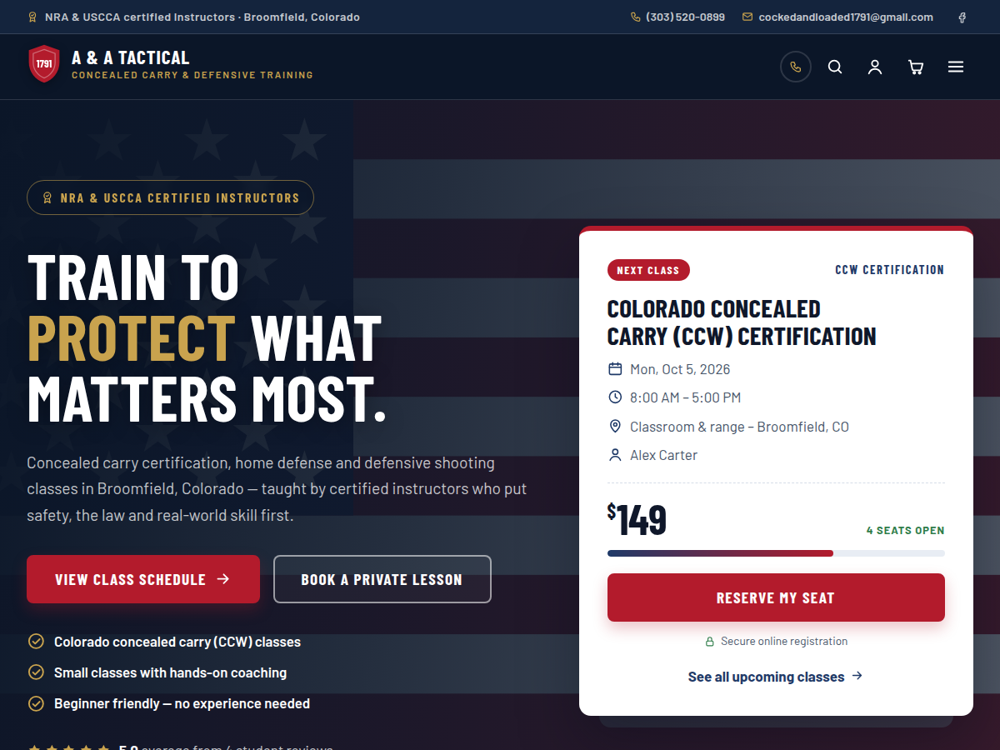

# Concealed 1791: WordPress theme

A classic WordPress theme for **concealed1791.com** (A & A Tactical, Broomfield, Colorado). It is built to sell training: concealed carry certification, defensive shooting, home defense, scenario training, CPR/First Aid and private lessons. It keeps concealed1791.com's patriotic navy, red and brass look, including **American flag** and **target** background artwork. It adds the conversion layout of protectwithbear.com: plan cards with a pricing switch, a benefits grid, how-it-works steps, star-rated reviews, a FAQ and a strong call to action. **Appearance → Theme Settings** controls the sidebars, menus, footer columns, color scheme and the WooCommerce, FunnelKit, Elementor, Amelia and MailPoet integrations.



## Live demo

| Option | How |
| --- | --- |
| **In your browser (nothing to install)** | Open [WordPress Playground with this theme](https://playground.wordpress.net/?blueprint-url=https://raw.githubusercontent.com/kamodev/Concealed1791/main/blueprint.json). It installs WordPress, WooCommerce, Elementor, Amelia Lite, FunnelKit and this theme, loads the demo content and logs you in as admin. Each visit starts fresh, and nothing is saved. |
| **On your computer** | `bin/demo-server.sh`, then open http://localhost:8080 (log in with **admin / admin**). See [Demo server](#demo-server). |

MailPoet needs MySQL/MariaDB, so neither demo includes it. Test MailPoet on a staging copy of the live site.

## Design

**From concealed1791.com:** the business (A & A Tactical), its classes, NRA and USCCA certified instructors, Broomfield location and contact details. It also keeps the flag-navy / flag-red palette with a brass highlight, the **American flag** background (front page hero) and the **target** background (page banners and the call-to-action band). Both backgrounds are built-in SVGs, and either can be swapped for your own photo.

**From protectwithbear.com:**
- a dismissible promo bar and a contact top bar
- a sticky header with a call button and a booking button
- a bold hero with a trust checklist and an offer card (here, a live "next class" card with price, seats left and a seat meter)
- a certification strip that overlaps the hero
- a benefit grid with labels
- three how-it-works steps
- plan cards with an "Individual / Bring a partner" pricing switch and a "Most popular" badge
- a star-rating summary beside reviews
- a FAQ accordion (with FAQ structured data)
- a call-to-action band above the footer

Headings use Barlow Condensed and text uses Barlow (Google Fonts).

## Theme Settings (Appearance → Theme Settings)

| Tab | What it controls |
| --- | --- |
| **General** | Phone, email, address, map link, hours, tagline, reviews link and social profiles. These feed the top bar, header, call-to-action band, footer and LocalBusiness structured data. |
| **Header & Menus** | Announcement bar, top bar (message, contact details, social icons), header layout (logo left, or logo centered with the menu below), sticky header, phone, search, booking button and menu lettering. **Menu locations** (Main, Mobile, Top Bar, Footer Bottom) are assigned right here and saved to WordPress's own menu settings. |
| **Sidebars** | For posts, pages, blog/archives and the shop, each separately: show or hide the sidebar, left or right, and which widget area to use. Also sidebar width, sticky sidebar and **extra widget areas** (one name per line, e.g. "Class Sidebar"). Posts and pages have a per-page *Sidebar* box (default, left, right, none). |
| **Footer** | Background (dark, secondary or light), brand column, **0–4 columns**, column widths, and what **each column** shows: class links, latest posts, a chosen menu, contact details, hours, newsletter sign-up, custom text or widgets. There's a live layout preview. Also the call-to-action band, disclaimer, copyright and back-to-top button. |
| **Colors & Style** | 13 colors with 4 presets (Concealed 1791, Stealth Black, Guardian Blue & Gold, Ranger Green), a live preview and readability (contrast) checks. Button shape (rounded, pill, square, blade-cut), heading case, and **background artwork**: flag, target, photo or plain for the hero, page banners, call-to-action band and footer, plus shade strength and your own flag/target images. |
| **Integrations** | Plugin status (with install/activate links) and settings for WooCommerce, FunnelKit, Elementor, Amelia and MailPoet (details below). |
| **Import / Export** | Download all Theme Settings and home page content as JSON, import them on another site (demo → live), or reset to defaults. |

Settings live in the `c1791_settings` option; read one with `c1791_setting( 'key' )`. Front page content (hero text, benefits, steps, section titles, newsletter) is edited with live preview under **Customize → Concealed 1791: Home Page**. The colors are also editable there.

## Content types

| Type | Used for |
| --- | --- |
| **Classes** (+ *Class Types*) | Schedule at `/classes/`, filters by type, a past-classes view, and class pages with a sticky booking box, seat meter, what's included and what to bring. Fields: dates, time, length, location, price, capacity, seats left, level, registration link, includes, bring, prerequisites, instructors. |
| **Instructors** | Directory at `/instructors/` and profile pages listing each instructor's upcoming classes. |
| **Packages** | Pricing cards on the front page: two prices each (for the pricing switch), features (start a line with `-` for "not included"), highlight badge and button link. |
| **FAQs** | Front page accordion, plus a full list on any page using the **FAQ** template. |
| **Testimonials** | Star-rated reviews and the rating summary. |

## Plugin integrations

These are adapted from the [kamodev/PEN](https://github.com/kamodev/PEN) theme's integrations. Each one is optional and only runs while its plugin is active.

- **WooCommerce** (`inc/woocommerce/`) is update-safe: the theme has no template overrides and uses hooks and CSS only.
  - Shop, product, cart, checkout (classic and blocks) and My Account pages match the theme.
  - The shop has its own sidebar setting, and there are cart and account icons in the header.
  - The checkout uses a distraction-free, logo-only header.
  - A featured-products section appears on the front page.
  - **New:** link a class or package to a product and its button adds it to the cart and opens checkout. Product stock becomes the class's seats left, and a blank price uses the product price.
- **FunnelKit** (`inc/woocommerce/funnelkit.php`): funnel steps show only their own content, with a minimal header and footer (or the full header) and no banner, sidebar, menu or call-to-action band.
- **Elementor** (`inc/integrations/elementor.php`):
  - "Add New" opens Elementor; you can switch this back to the block editor.
  - Elementor pages run full width, and a front page built with Elementor can replace the theme's sections.
  - Elementor Pro's Theme Builder header and footer are supported.
  - The global kit's colors and fonts stay matched to Theme Settings, with a one-click restore.
  - Add `ct-art ct-art--flag` or `ct-art ct-art--target` to a section's CSS classes to use the flag or target backgrounds.
- **Amelia** (`inc/integrations/amelia.php`):
  - Set an *Amelia event ID* on a class to show Amelia's booking form under "Reserve Your Seat"; every Register button then jumps to it.
  - Set an *Amelia employee ID* on an instructor to show a private-lesson booking form on their profile.
  - Booking forms match the theme, and the Integrations tab lists the matching values to enter in Amelia → Customize.
- **MailPoet** (`inc/integrations/mailpoet.php`):
  - The front page newsletter band, and any footer column set to *Newsletter sign-up*, add people to a chosen MailPoet list. A honeypot and a per-IP rate limit protect the form, and MailPoet's double opt-in still applies.
  - Alternatively, a chosen MailPoet form replaces the theme's form.
  - MailPoet forms are styled to match the theme.

### Hooks for developers

| Hook | Use |
| --- | --- |
| `c1791_settings_fields`, `c1791_color_presets`, `c1791_settings_tab` | Add settings, presets or fields on a tab |
| `c1791_front_page_sections`, `c1791_home_section_{name}` | Reorder or add front page sections |
| `c1791_class_data`, `c1791_package_data` | Change class or package details (register links, prices, seats) |
| `c1791_bare_content`, `c1791_minimal_header`, `c1791_sidebar_context`, `c1791_front_page_bare` | Layout control for page builders, funnels and checkout |
| `c1791_header_actions`, `c1791_class_after_content`, `c1791_instructor_after_content` | Add header icons or sections to class and instructor pages |
| `c1791_meta_fields`, `c1791_widget_areas`, `c1791_style_parts` | Add fields, widget areas or stylesheet parts |
| `c1791_newsletter_form_html`, `c1791_mailpoet_rate_limit`, `c1791_amelia_shortcodes`, `c1791_funnel_post_types` | Adjust the integrations |

## Install on concealed1791.com

1. Build the zip with `bin/build-release.sh` (or zip this folder) and upload it under **Appearance → Themes → Add New → Upload**. Then activate it.
2. **Settings → Permalinks** → Save (so `/classes/` and `/instructors/` work).
3. Fill in **Appearance → Theme Settings → General** (phone, email, address, hours, social links) and assign menus on **Header & Menus**.
4. **Settings → Reading**: set a static front page. The theme's front page sections appear automatically.
5. Add classes, instructors, packages, FAQs and testimonials, and set a logo under **Appearance → Customize → Site Identity**.

To copy the look from a demo or staging site, use **Theme Settings → Import / Export**.

## Demo server

```bash
bin/demo-server.sh                        # http://localhost:8080  (admin / admin)
PORT=9000 bin/demo-server.sh
HOST=0.0.0.0 SITE_URL=http://192.168.1.20:8080 bin/demo-server.sh   # reachable from other devices
WITH_WOOCOMMERCE=0 bin/demo-server.sh
RESET=1 bin/demo-server.sh                # wipe the demo site and rebuild it
```

The script needs `php` (with `pdo_sqlite`), `git`, `curl` and `unzip`, but no MySQL or Docker. It installs WordPress 7.1 with SQLite next to this folder (`../concealed1791-demo`), then:
- links the theme into it,
- installs WooCommerce from GitHub, and Elementor, Amelia Lite and FunnelKit from wordpress.org (skipped with a warning if wordpress.org can't be reached),
- loads the demo content from `bin/seed-demo.php`,
- starts PHP's built-in server.

WooCommerce's background queue doesn't run on SQLite, so the demo turns it off with a small must-use plugin. A real site on MySQL doesn't need that.

**Demo content is sample content.** The instructors, reviews, prices, dates and FAQ answers are placeholders; replace them before going live. The business details come from public listings for A & A Tactical, so check them too.

## Release zip

```bash
bin/build-release.sh    # → dist/concealed1791-<version>.zip (+ .sha256)
```

The zip is built from committed files and leaves out `bin/`, `README.md`, `blueprint.json` and Git files. The build stops if the versions in `style.css` and `functions.php` differ, if any PHP file fails `php -l`, or if a WooCommerce template-override folder exists.
